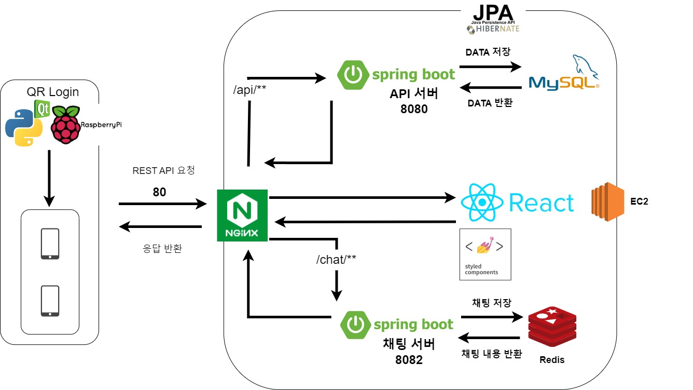
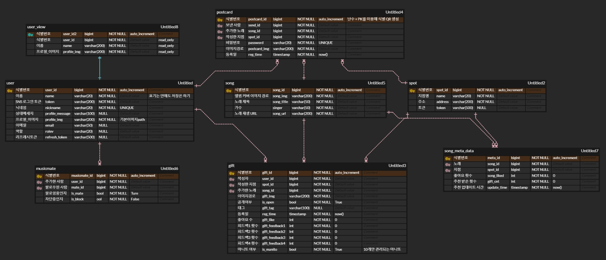

# **Audi:ro** - 웹 IoT 음악 취향 공유 플랫폼
## 📖 **개요**
음악 마니또를 컨셉으로 IoT 기기에서 음악 추천과 함께 엽서를 남길 수 있습니다. 기기의 다음 이용자가 엽서에 답장을 할 수 있으며 이는 웹으로 연동되어 채팅을 이어나갈 수 있습니다. 웹에서는 사용자가 추천한 음악과 작성했던 엽서를 확인할 수 있습니다.
## 📅 **프로젝트 진행 기간**
2023.01.09 ~ 2023.02.17
## 📝 **주요 기능**
- 기기의 QR을 통한 웹 로그인 연동
- 엽서 작성 및 노래 추천
- 랜덤으로 보여지는 추천된 엽서를 선택해서 음악 감상
- 엽서에 답장 및 채팅 연동
- 웹페이지 작성한 엽서 조회
## ✨ **기술 특이점**
## ⌨️ **주요 기술 스택**
### Back-end 
- Java8
- Spring boot 2.7.7
- Spring security, JWT
- Spring Data JPA
- WebSocket, STOMP
### DataBase
- MySQL
- Redis
### Front-end 
- React
- JavaScript
- Styled Components
### Infra
- AWS EC2
- Nginx
## 💫 **시스템 아키텍처**

## ✨ **ER Diagram**

## 🤔 **기획 산출물**
- 기능 명세서
- 와이어 프레임
- API 명세서
## ✨ **협업 과정**
- Git convention
- Jira
## 😃 **팀원 역할**
- 김성환(본인) - 기획, Back-end
- 김호성 - Front-end
- 신승호 - Embedded
- 윤소희 - Back-end
- 이가옥 - 팀장, Front-end, CI/CD